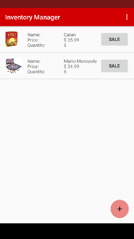

# InventoryManager
This app is my final project for my Android Beginners Nanodegree. It simulates inventory for a board game store allowing the user to
add board games to their inventory. Each game keeps track of an image (by pointing to a url), a supplier phone number, the price, and
the quantity in stock.

  
